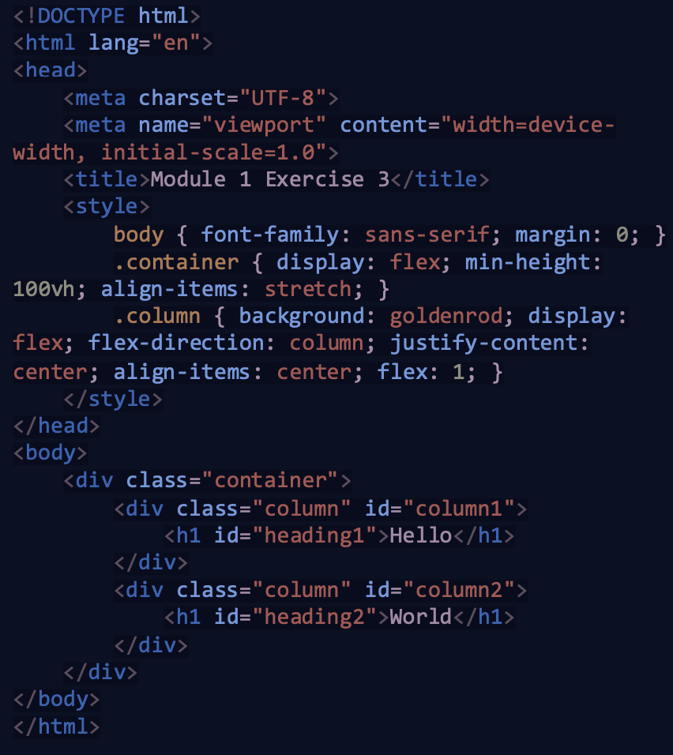

## Description

This file contains the exercises for IOD Labs

## Exercise 1

## Exercise 2
## Exercise 3

Using this code as a starter:
1. Add an image to each column
2. Add a ‘Change Me’ button under each heading
3. Style your buttons with CSS
4. Add a script tag with two JS functions, one for each button
5. Clicking each button should change the background colour and the heading text for that column.
Extension 1: Add text fields under the headings, and replace the heading text with
the value of the text fields when the buttons are clicked!
Extension 2: Move the CSS and JS code into external files linked from the HTML.

## Exercise 4

Use the learnings from this lesson to design some very simple functions.
Call them with different values.
- Create 4 functions for the 4 main mathematical operations (-,+,/,*).
  Return the calculated value and then output it to the screen.
- Create a function that takes the name of a person as an argument, and prints out “Hello <name>” to the console.
  Hint: search online on how to concatenate two strings.

## Exercise 5
## Exercise 6
## Exercise 7
## Exercise 8
